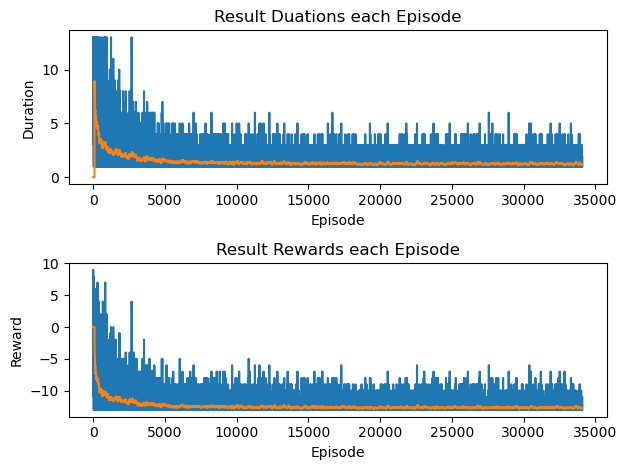
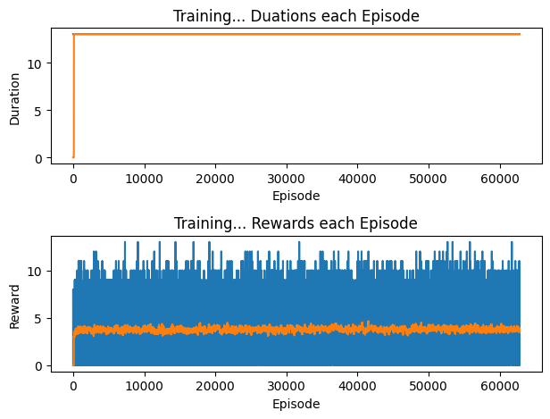
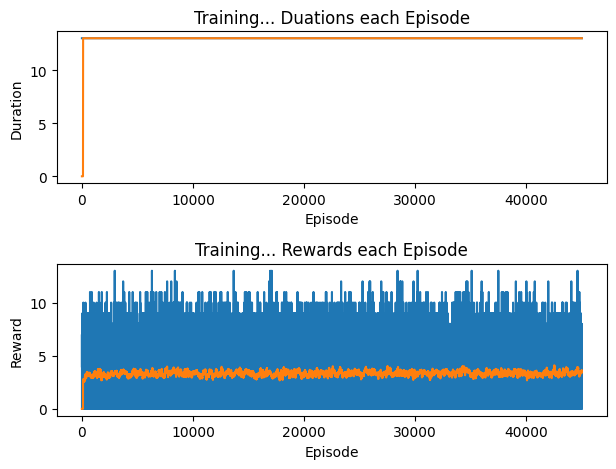
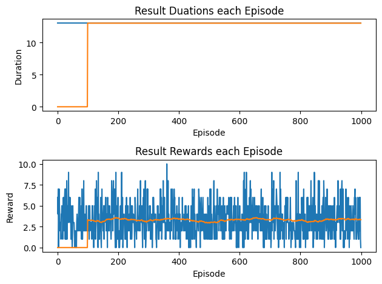
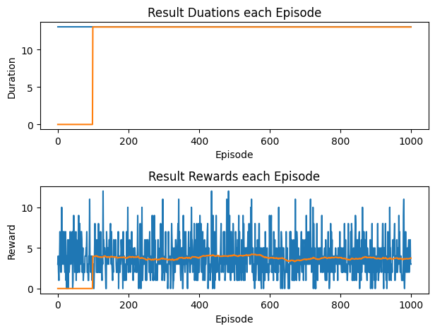
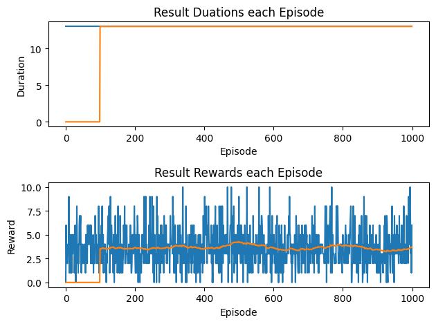
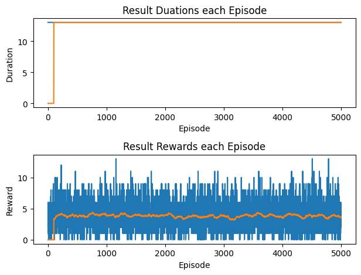
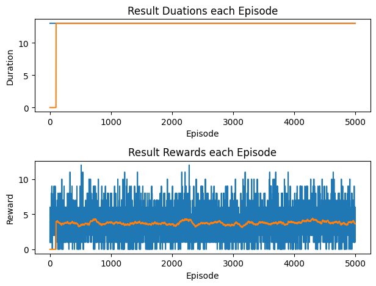

# Technical Findings From Existing Notebooks
This report preserves results already saved in the project notebooks. It does not rerun training. The original notebook outputs remain in place; extracted plots are copied into `reports/assets/` for easier use in a write-up.
## High-Level Takeaways
- Random legal play is a useful lower baseline: `experiments.ipynb` reports 3.308 tricks/reward per game over 1000 games.
- The one-turn greedy policy remains a strong simple baseline: `experiments.ipynb` reports 3.8 tricks/reward per game over 1000 games.
- A trained legal-action DQN checkpoint (`weights/q_fn_816-100000.pth`) slightly beats the greedy baseline in one saved evaluation: 3.819 reward per game over 5000 games.
- Another trained checkpoint (`weights/ev_q_function_output_outside_folder.pth`) scores 3.742 reward per game over 5000 games, below greedy but above random.
- Legal action masking makes game completion reliable in saved evaluations: legal-mask/self-play training summaries show all 100 simulated games reaching the terminal bucket, and evaluation runs report 13 agent moves / full games.
- The unmasked legality-learning DQN shows evidence of learning rules but still terminates early in the saved 100-game training evaluation at 1000 episodes: average simulated duration 1.48 agent moves. Later notebook outputs compare loaded test/policy networks around 11.1 average moves before illegal termination.
## Extracted Benchmark Results
| Source | Policy / checkpoint | Games | Avg duration | Avg reward | Notes |
| --- | --- | ---: | ---: | ---: | --- |
| `experiments.ipynb` | random legal policy | 1000 | 13.0 | 3.308 | full games |
| `experiments.ipynb` | greedy policy | 1000 | 13.0 | 3.8 | strong hand-coded baseline |
| `experiments.ipynb` | trained network, `q_fn_816-100000.pth` | 5000 | 13.0 | 3.819 | best saved benchmark in notebooks |
| `experiments.ipynb` | trained network, `ev_q_function_output_outside_folder.pth` | 5000 | 13.0 | 3.742 | below greedy, above random |
| `experiments.ipynb` | trained network output shown after refactor edits | 1000 | 13.0 | 3.666 | likely from `q_fn_816-100000.pth` cell after notebook edits; keep as historical output only |
| `dqn_training.ipynb` | unmasked training snapshot | 100 | 1.48 | 0.2259 per move | early 1000-episode result, many illegal terminations |
| `dqn_training with legal moves.ipynb` | legal-mask training snapshot | 100 | 14.0 bucket | 0.2862 per move | all simulations reached final bucket in saved distribution |
| `dqn_training with previous training.ipynb` | self-play/frozen-opponent snapshot | 100 | 14.0 bucket | 0.262 per move | all simulations reached final bucket in saved distribution |
## Training Findings
### Unmasked DQN
The unmasked DQN attempted to learn both legality and trick value from Q-values. The saved 1000-episode output reports average reward per move of 0.225936 and average simulated game duration of 1.48 agent moves, with most games ending in the first two duration buckets. This supports the original README observation that learning legality directly is difficult and sensitive to the discount factor. A later comparison of loaded networks reports average simulated durations around 11.11 moves, suggesting later or different checkpoints learned much more of the legality constraint but still did not always finish a full 13-turn agent game.
### Legal-Move DQN
The legal-move notebook shows a long training snapshot at 62,800 episodes with average reward per move 0.286154 and all 100 evaluation games in the final duration bucket. This is the cleanest training evidence that masking illegal moves lets the network focus on trick-taking rather than rule discovery.
### Previous-Training / Self-Play Variant
The previous-training notebook shows a 40,000-episode snapshot against a loaded network opponent with average reward per move 0.262 and all 100 evaluation games in the final duration bucket. This result is useful for discussing first attempts at moving from random opponents toward self-play or frozen-opponent training.
## Annotated Figures Preserved
All extracted plots use the same two-panel format. The top panel is duration per episode/game, and the bottom panel is reward per episode/game. Blue traces show individual runs; orange traces are the notebook's 100-run moving average where enough points exist.

### Unmasked DQN Training Diagnostics


Extracted from `dqn_training.ipynb`, cell 21. This figure is useful for explaining why learning legality directly is hard. Duration initially reaches higher values but collapses toward short games, while rewards trend downward into a large negative range. In the original unmasked setup, illegal moves terminate games and create strong negative feedback, so this plot supports the report argument that the agent spent much of training fighting the rules rather than optimizing trick-taking.

`reports/assets/dqn-training-cell-21-output-1.png` is a duplicate display of the same unmasked-DQN training diagnostic from the same notebook cell. Keep one copy in the report and treat the second as a redundant extraction artifact.

### Legal-Move DQN Training Diagnostics


Extracted from `dqn_training with legal moves.ipynb`, cell 21. This is one of the most report-worthy training plots. The duration curve rapidly saturates at full-game completion because legal action masking prevents illegal termination. The reward curve remains noisy by episode but has a stable moving average around the 3-to-4 trick range. Use this figure to motivate action masking as the cleaner formulation for trick-taking performance.

### Frozen-Opponent / Previous-Training Diagnostics


Extracted from `dqn_training with previous training.ipynb`, cell 21. This plot shows the first move from random opponents toward trained-network opponents. As with the legal-mask run, duration stays at full-game completion, but the reward moving average is slightly lower than the legal-mask training snapshot. Use it as preliminary self-play/frozen-opponent evidence rather than the strongest final result.

### Random Policy Baseline Evaluation


Extracted from `experiments.ipynb`, cell 6. This plot corresponds to the random legal policy baseline over 1000 games. Duration reaches full games, but reward is noisy with an average of 3.308 tricks/reward per game. Use this as the lower baseline: random legal play completes games but does not optimize trick-winning.

### Greedy Policy Baseline Evaluation


Extracted from `experiments.ipynb`, cell 8. This plot corresponds to the one-turn greedy policy over 1000 games. The saved output reports 3.8 average reward per game. The figure is important because it shows the hand-coded baseline is strong and stable, making it a meaningful comparison target for DQN checkpoints.

### Trained Network Evaluation: `q_fn_816-100000.pth`


Extracted from `experiments.ipynb`, cell 14. This evaluates `weights/q_fn_816-100000.pth` over 1000 games in the saved notebook state and reports 3.666 average reward per game. Because a later saved output for a nearby trained-network evaluation reports 3.819 over 5000 games, use this plot mainly as a visual example of trained-network evaluation variance and full-game completion.

### Trained Network Evaluation: `ev_q_function_output_outside_folder.pth`


Extracted from `experiments.ipynb`, cell 15. This plot corresponds to a 5000-game trained-network evaluation whose saved output reports 3.819 average reward per game. This is the best saved benchmark in the notebooks and slightly exceeds the greedy baseline, so it is the most useful evaluation figure for a positive DQN result.

### Self-Play Checkpoint Evaluation: `self-play-40000.pth`


Extracted from `experiments.ipynb`, cell 17. This plot evaluates `weights/self-play-40000.pth` over 5000 games. The saved output reports 3.742 average reward per game, below the greedy baseline and below the best trained-network checkpoint but above random. Use it to discuss that early self-play/frozen-opponent work was viable but not yet clearly better than the simpler legal-mask DQN.

### Other Existing Project Figures
Existing figure files worth considering for the report: `figures/network-input-output.png`, `figures/training-10000.png`, `figures/gamma-0.5-100000.png`, `figures/20000-epi.png`, and `notes/DQNNotes.png`. These were not embedded-output extractions from the current notebooks, but they may be useful for architecture diagrams or historical training curves.
## Raw Notebook Output Excerpts
The excerpts below are copied/summarized from notebook output streams and are useful audit trails when writing the report.
### `dqn_training.ipynb`, cell 20
```text
Trained 1000 episodes
Average reward per move: 0.22593646277856805.
Average simulated game duration: 1.48
Distribution of simulated game lengths: [69, 21, 5, 3, 2, 0, 0, 0, 0, 0, 0, 0, 0, 0]
Memory bank: [1000, 760, 595, 444, 332, 269, 212, 156, 128, 101, 86, 73, 62]
```
### `dqn_training.ipynb`, cell 22
```text
Average simulated game duration of test: 11.1076
Average simulated game duration of policy: 11.1212
Distribution of game lengths of test: [70, 94, 230, 297, 375, 404, 530, 614, 600, 498, 471, 330, 320, 5167]
Distribution of game lengths of policy: [77, 84, 225, 288, 416, 401, 545, 601, 540, 501, 459, 314, 342, 5207]
```
### `dqn_training with legal moves.ipynb`, cell 21
```text
Trained 62800 episodes
Average reward per move: 0.28615384615384615.
Average simulated game duration: 14.0
Distribution of simulated game lengths: [0, 0, 0, 0, 0, 0, 0, 0, 0, 0, 0, 0, 0, 100]
Memory bank: [10000, 10000, 10000, 10000, 10000, 10000, 10000, 10000, 10000, 10000, 10000, 10000, 10000]
```
### `dqn_training with legal moves.ipynb`, cell 22
```text
Average simulated game duration of test: 11.1076
Average simulated game duration of policy: 11.1212
Distribution of game lengths of test: [70, 94, 230, 297, 375, 404, 530, 614, 600, 498, 471, 330, 320, 5167]
Distribution of game lengths of policy: [77, 84, 225, 288, 416, 401, 545, 601, 540, 501, 459, 314, 342, 5207]
```
### `dqn_training with previous training.ipynb`, cell 21
```text
Trained 40000 episodes
Average reward per move: 0.262.
Average simulated game duration: 14.0
Distribution of simulated game lengths: [0, 0, 0, 0, 0, 0, 0, 0, 0, 0, 0, 0, 0, 100]
Memory bank: [10000, 10000, 10000, 10000, 10000, 10000, 10000, 10000, 10000, 10000, 10000, 10000, 10000]
```
### `dqn_training with previous training.ipynb`, cell 22
```text
Average simulated game duration of test: 11.1076
Average simulated game duration of policy: 11.1212
Distribution of game lengths of test: [70, 94, 230, 297, 375, 404, 530, 614, 600, 498, 471, 330, 320, 5167]
Distribution of game lengths of policy: [77, 84, 225, 288, 416, 401, 545, 601, 540, 501, 459, 314, 342, 5207]
```
### `experiments.ipynb`, cell 6
```text
Simulated 1000 games.
Average simulated game duration: 13.0
Average reward per game: 3.308
Distribution of simulated game lengths: [0, 0, 0, 0, 0, 0, 0, 0, 0, 0, 0, 0, 0, 1000]
```
### `experiments.ipynb`, cell 8
```text
Average simulated game duration: 13.0
Average reward per game: 3.8
Distribution of simulated game lengths: [0, 0, 0, 0, 0, 0, 0, 0, 0, 0, 0, 0, 0, 1000]
```
### `experiments.ipynb`, cell 14
```text
Average simulated game duration: 13.0
Average reward per game: 3.666
Distribution of simulated game lengths: [0, 0, 0, 0, 0, 0, 0, 0, 0, 0, 0, 0, 0, 1000]
```
### `experiments.ipynb`, cell 15
```text
Simulated 5000 games.
Average simulated game duration: 13.0
Average reward per game: 3.819
Distribution of simulated game lengths: [0, 0, 0, 0, 0, 0, 0, 0, 0, 0, 0, 0, 0, 5000]
```
### `experiments.ipynb`, cell 17
```text
Simulated 5000 games.
Average simulated game duration: 13.0
Average reward per game: 3.742
Distribution of simulated game lengths: [0, 0, 0, 0, 0, 0, 0, 0, 0, 0, 0, 0, 0, 5000]
```
## Report-Writing Notes
- Use greedy as the main non-learning baseline, not random. The greedy policy is very competitive and easy to explain.
- Distinguish two objectives: learning legality from penalties/termination versus maximizing tricks under a legal-action mask. The saved results support the masked-action framing as more productive.
- Be careful comparing “duration bucket 14” from old notebook code with “13 moves” in the evaluation notebook. The former appears to be a bucket/indexing artifact for full completion, while the evaluation helper reports 13 agent turns.
- Treat self-play results as preliminary: the saved frozen-opponent/self-play snapshot completes games but has lower per-move reward than the legal-mask snapshot.
